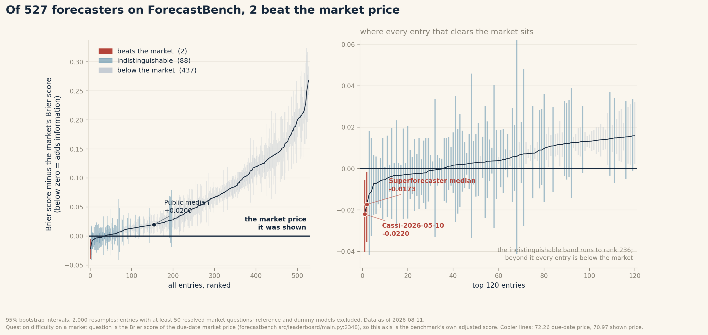

# The Copier Line

Analysis code and derived data for a review of how ForecastBench scores market questions.

**Headline result.** Of 527 forecasters on ForecastBench with at least 50 resolved market
questions, two beat the market price they were shown at 95% confidence: `Cassi-2026-05-10` and the
`Superforecaster median forecast`. Eighty-eight are statistically indistinguishable from the market
price and 437 score below it.



## What this measures

On the ForecastBench tournament leaderboard, the difficulty of a market question is defined as the
Brier score of the market price on the forecast due date. That is what the scoring code does:
`src/leaderboard/main.py:2348` in `forecastingresearch/forecastbench` takes the estimated question
fixed effects directly from a reference model whose forecast equals `market_value_on_due_date` on
100% of resolved market rows.

A forecaster reproducing that price therefore scores exactly zero on the difficulty-adjusted scale.
That gives the leaderboard an implicit zero point, computable on any date, which the board does not
draw. This repository computes it.

| | Market Brier Index |
|---|---|
| Copier of the due-date price, the benchmark's implicit zero | 72.26 |
| Copier of the shown price, what a prompt-copier actually scores | 70.93 |
| Superforecaster median | 75.60 |
| Cassi-2026-05-10 | 76.60 |

Figures as of 2026-08-11. Every number is recomputable for any date with published data.

## Contents

```
copier_line.py              data layer: anchor C, both copier lines, per-entry bootstrap -> JSON
figures.py                  two plot functions reading that JSON
extract_baseline_drift.py   rebuilds the tournament leaderboard from git history
analyse_freeze_values.py    paired freeze-value experiment and market-tracking statistics

data/                       derived outputs, all reproducible from the scripts
figures/                    fig1_vs_market.png, fig2_drift.png
article/                    the write-up
```

## Reproducing

Python 3.10+.

```bash
pip install -r requirements.txt

# inputs, all public
git clone https://github.com/forecastingresearch/forecastbench-datasets.git
curl -O https://www.forecastbench.org/assets/data/processed-forecast-sets/processed_forecast_sets.tar.gz
tar -xzf processed_forecast_sets.tar.gz

# question fixed effects, one file per board per day
curl -O "https://forecastbench.org/assets/data/question-fixed-effects/question_fixed_effects.2026-08-11.tournament_leaderboard.json"

# run
python copier_line.py --date 2026-08-11 \
    --repo path/to/forecastbench-datasets \
    --processed path/to/forecastbench-processed-forecast-sets
python figures.py --blob copier_line.2026-08-11.json
```

`extract_baseline_drift.py` needs a full, non-shallow clone of `forecastbench-datasets`, since it
walks 239 revisions of the tournament leaderboard.

## Method notes

**The bootstrap.** For each entry with at least 50 resolved market questions, resample its questions
2,000 times and take the 95% interval of the mean of `brier_model − brier_market`. Imputed forecasts
are excluded throughout. Reference and dummy models (`Always 0.5`, `Imputed Forecaster`,
`Random Uniform`, and similar) are excluded from reported counts.

**Two prices.** The scoring rule uses the market price on the forecast due date. Forecasters were
shown the freeze value, ten days older. Over 3,175 questions where both are known these score 0.0767
and 0.0843, so the two copier lines differ by 1.34 index points. Resemblance between a forecast and
either price is evidence about resemblance, and says nothing about mechanism.

**The metric break.** The published leaderboard reports raw Brier scores until 2026-03-04 and the
Brier Index afterwards. Series crossing that date are not meaningful. Everything here starts after it.

## Data provenance

- `forecastingresearch/forecastbench-datasets`, CC BY-SA 4.0: question sets, resolutions, leaderboard history
- `forecastbench.org`: processed forecast sets, question fixed-effects files
- `forecastingresearch/forecastbench`, MIT: the scoring rule

ForecastBench is built and maintained by the Forecasting Research Institute. This repository is an
independent analysis of published data and is not affiliated with FRI.

## Licence

Code MIT. Derived data under `data/` inherits CC BY-SA 4.0 from the upstream datasets.
