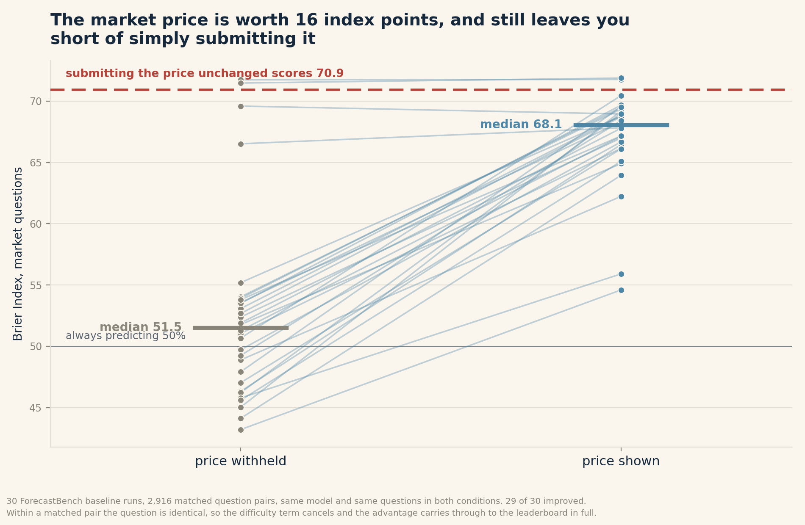
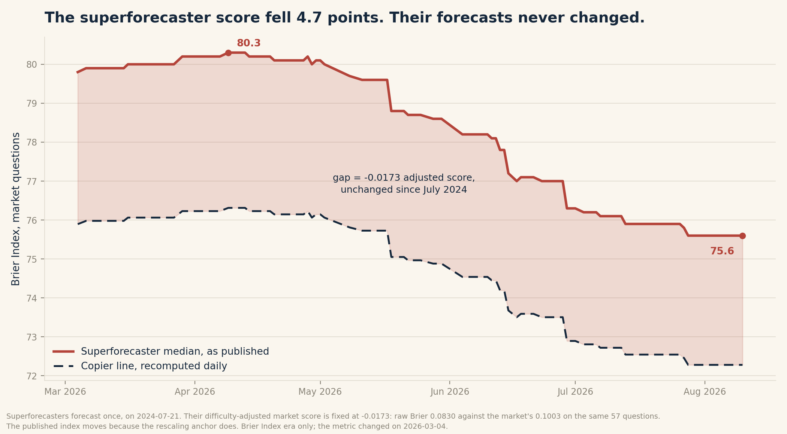
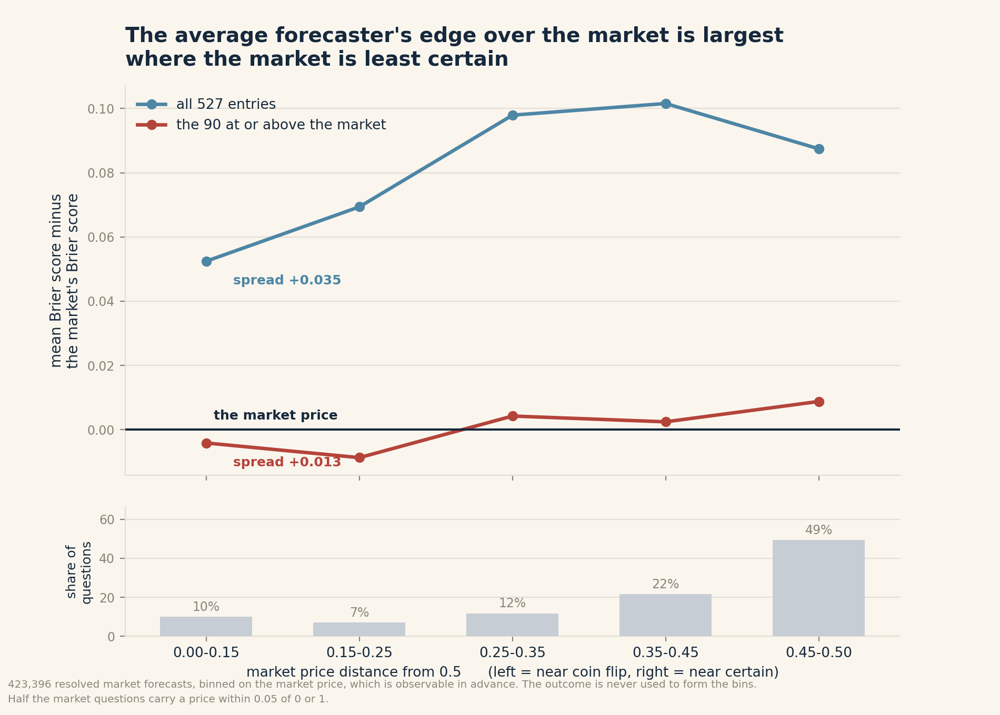

# The Copier Line: What ForecastBench's Market Scores Measure

*Figures as of 11 August 2026. The leaderboard updates nightly. The method for recomputing
every number here on any date is given in full, and the code is linked:
https://github.com/OJdominus/forecastbench-copier-line*

As of August 11, 2026, ForecastBench had tested 527 forecasters. Of those with enough resolved
market questions to test, **442 scored worse than the market price provided to them**, and none can
be shown to have beaten it once you account for having run 527 tests at once.

Two come closest, and they are the two the argument was already about. Namely, **Cassi-2026-05-10**
and the **superforecaster median**.

Those two are what this piece focuses on.


*Figure 1. Every entry's Brier score minus the market's Brier score on the same questions, with 95%
bootstrap intervals. This is the benchmark's own difficulty-adjusted market score. Two intervals lie
entirely below the line.*

## Why we are looking into this

In July this year, the Forecasting Research Institute (FRI) released a report that claims AI models
are performing at the same level with superforecasters on ForecastBench. In the second heading of
its report, they went further to identify an AI system that ranked above superforecasters on market
questions for the first time.

FRI argues that market questions are the better test of human-like forecasting skill, as they often
require judgment about novel, one-off events. On that reading it is a significant result that an AI
system beat superforecasters on those questions.

Three weeks later, Good Judgment countered with a response. Their argument was that the human scores
came from a single session held in July 2024 and that comparing a continuously improving machine
against a two-year-old snapshot of a human is not a fair race.

But more importantly, they pointed out that in FRI's work, one model prediction had a 0.994
correlation with the market prices it was shown. Meaning that the AI models might not be forecasting
independently but instead copying market prices and making adjustments.

Another piece of evidence we can put into view is a test run by the Financial Times (FT) on AI
against both the market and human superforecasters on Federal Reserve interest rate decisions,
reported here secondhand through Good Judgment's summary. The AI drew level with the market and not
better. The FT then concluded that AI lacks the judgment to spot market errors and outperform them.

In conclusion, everyone agrees that market questions might as well be the real benchmark for
artificial intelligence, but no one has actually published what a market question score actually
measures. What follows is the same question asked of 423,396 resolved market forecasts, using the
benchmark's own scoring rule.

## Tldr

1. Of 527 entries, **442 score significantly below the market price** at a 5% false discovery rate
   across all 527 tests. **Zero** entries survive the same correction in the other direction.
2. Two clear an uncorrected test, and they are the two that clear it: Cassi-2026-05-10 (−0.0220, CI
   −0.0403 to −0.0055, exact bootstrap p = 0.004) and the superforecaster median (−0.0173, CI −0.0354
   to −0.0016, p = 0.017). Both were named in advance by other people, which is why it is fair to read
   them uncorrected.
3. The scoring rule implies a zero point. A forecaster submitting the price it was shown scores
   **70.93** on the Brier Index. Superforecasters sit 4.67 above it, Cassi 5.67.
4. The published index is not comparable across dates. The superforecasters' adjusted score has been
   **−0.0173** since July 2024, and their published index still fell 4.7 points in four months
   because the rescaling anchor rose 36.9%.

## Two different nulls, and 527 tests

FRI reports a bootstrap one-sided p-value of 0.41 for Cassi against the null that it is equally
accurate as superforecasters, with 0.16 and 0.15 for xAI's submissions and 0.14 for Google
DeepMind's. FRI itself notes that many of the confidence intervals overlap substantially, making the
results more consistent with parity than with clear outperformance by AI.

That test asks whether an AI matches the superforecasters. The test here asks whether either matches
the price both were shown. Both findings can be true, and they are complementary.

The second test carries a cost the first does not. Running it once per entry means running it 527
times, and a two-sided 95% interval falls entirely below zero 2.5% of the time when the true edge is
exactly zero. Of the 527, 437 are significantly below the market on the uncorrected test, so their
true effect is not near zero. That leaves 90 whose edge could plausibly be nothing. **If none of
those 90 had any edge at all, chance alone would put 2.2 of them below the line. Two are there.**

Benjamini-Hochberg at a 5% false discovery rate returns zero discoveries in that direction and 442
in the other. So the honest reading is that no entry on this board demonstrably beats the price it
was shown, and the great majority demonstrably lose to it.

Cassi and the superforecasters stay interesting for a different reason. They were not selected by
this search. FRI's July post named Cassi. Good Judgment's reply named the superforecasters. Testing
those two is a hypothesis someone else registered three weeks in advance, and on that basis their
exact bootstrap p-values of 0.004 and 0.017 are worth reporting. They are also the only two that
come close: the next strongest sits at 0.035, and nothing else clears 0.05.

## What Counts as a Market Question

Each round contains 500 questions, 250 market and 250 dataset. Market questions come from `infer`,
`manifold`, `metaculus`, and `polymarket`. Dataset questions are generated from `acled`,
`dbnomics`, `fred`, `wikipedia`, and `yfinance`.

Every question carries `freeze_datetime_value`, the source market's price on the day the question
set was created, ten days before the forecast due date. That value is shown to forecasters in their
prompts. Market questions take one forecast, dataset questions up to eight.

Three leaderboards exist. The **preliminary** board scores dataset questions only. The
**tournament** board adds market questions and produces the overall score, and it is the board the
parity commentary cites. The **baseline** board holds forecast files without freeze values.

The two boards use different difficulty adjustments. Across five consecutive days of published
fixed-effects files, **0 of 2,987** market question fixed effects changed on the tournament board
and **2,987 of 2,987** changed on the baseline board. The switch is at `main.py:3373-3377`:
baseline gets `TWO_WAY_FIXED_EFFECTS`, tournament gets `MARKET_BRIER`.

FRI confirmed the reasoning when I asked. Tournament models have access to tools and scaffolding,
so scoring them against the market price on the forecast due date is the appropriate reference.
Baseline models are handicapped in that respect, so their market questions get two-way fixed
effects instead. They also said they plan to retire the baseline leaderboard.

Everything below concerns the tournament board.

## How the Market Score Is Computed

Everything after this section depends on it. All of it is in `src/leaderboard/main.py` in the
ForecastBench repository, MIT licensed.

| Step | Function, line | What it does |
|---|---|---|
| Difficulty | `two_way_fixed_effects()`, 2348 | Dataset questions: least squares on `brier_score ~ 1 \| question_pk + model_pk`. Market questions on the tournament board: difficulty taken straight from the Brier score of a reference model, the **Imputed Forecaster**. |
| Adjusted score | same | `brier_score − question_fixed_effect`. The y-axis of Figure 1. |
| Rescaling | `rescale_difficulty_adjusted_brier()`, 2954 | Shifts every score by 0.25 minus the Always 0.5 model's score. That model scores `0.25 − mean(difficulty)`, so the shift equals mean difficulty. Call it **C**. |
| Index | `apply_brier_index_transform()`, 2985 | `Brier Index = (1 − √rescaled) × 100`. Square root, 0 to 100, where 100 is perfect and 50 is always predicting 50%. |
| Overall | 2610 | Mean of the dataset and market columns. |

Three things follow.

The Imputed Forecaster's forecast equals `market_value_on_due_date` on 100% of resolved market rows,
correlation 1.0000. **Market question difficulty is the squared error of the market price on the
forecast due date.**

The overall column is a straight mean, so 57 resolved market questions carry the same weight as 521
dataset questions.

The transform checks out. The superforecasters' adjusted market score is −0.0173 and C is 0.076935,
so their rescaled score is 0.059635 and `(1 − √0.059635) × 100 = 75.58` against a published 75.6.

## Data and Methodology

I shared this analysis with FRI before publishing. They were not able to review it in full and did
not wish to delay publication. They did confirm one methodological point, on why the tournament and
baseline boards estimate market-question difficulty differently, which is described below. Nothing
else here has been checked by them.

Eight different populations appear in this piece. They are all correct in their own context and
easy to confuse, so here they are together.

| Count | What it is | Where it is used |
|---|---|---|
| 572 | entries in the processed forecast sets with any resolved market forecast | scope of the data pull |
| 531 | of those, entries with at least 50 resolved market questions | correlation and copy-rate statistics |
| **527** | the same, with reference and dummy models removed | **the bootstrap population, and every headline count** |
| 442 | significantly below the market at 5% FDR across all 527 | the headline |
| 437 | below the market on the uncorrected per-entry interval | the multiplicity argument |
| 90 | not significantly below, so their true edge could be zero (88 + 2) | the 2.2 expected-by-chance calculation |
| 273 | rows on the published tournament leaderboard | counts against the two copier lines |
| 106 | leaderboard rows matched by name to the forecast sets (103 distinct entries) | joint analyses only |

The four reference models excluded from 531 to reach 527 are Always 0, Always 0.5, Always 1, and
Random Uniform.


**Forecast data**: the processed forecast sets published at forecastbench.org. 2,065 files across
33 rounds, 423,396 resolved market-question forecasts across 572 entries. Imputed forecasts are
excluded throughout. Models need 95% coverage to appear on the leaderboard and missing forecasts
are filled at 0.5.

**Question fixed effects**: FRI's daily published files, 2026-08-07 to 2026-08-11, both boards.

**Leaderboard history**: 239 git revisions of `leaderboards/csv/leaderboard_tournament.csv`, 121 of
them after the metric change below.

**The bootstrap**: for each entry with at least 50 resolved market questions, resample its questions
2,000 times and take the 95% interval of the mean adjusted score. Reference and dummy models are
excluded, leaving 527. A forecast is called "copied" when it falls within 0.5 percentage points of a
price, the threshold FRI used when reporting GPT-4.5.

### The metric break

The leaderboard file reports raw Brier scores until 2026-03-04 and the Brier Index afterwards.
Lower is better in one and higher in the other, and the two differ by roughly an order of
magnitude. Anchoring a series across that date is a trap of a familiar kind: the file looks
continuous, the column names do not change, and the values move by a factor of a thousand at a
single commit. Every series here starts 2026-03-04.

### Two market prices

`market_value_on_due_date` is the price on the forecast due date. The freeze value shown in prompts
is ten days older. Over 3,175 resolved market questions where both are known, the due-date price
scores a Brier of 0.0767 and the freeze value 0.0843. **The benchmark measures difficulty using
information better than any participant received.**

That distinction sets the range of the copier line below, and it limits behavioural inference. A
forecast resembling the due-date price is consistent with a model using the freeze value it was
given and equally consistent with one pulling a live price at submission. External entries do not
publish their prompt conditions. Every claim here about copying is a claim about resemblance to a
price and says nothing about mechanism.

## The Copier Line

Because market question difficulty is the market's own Brier score, a forecaster submitting a price
verbatim scores zero on the adjusted scale, and its index is `(1 − √C) × 100`. Two prices give two
lines.

| | Market Brier Index |
|---|---|
| Copier of the **due-date** price, the benchmark's implicit zero | 72.26 |
| Copier of the **shown** price, what a prompt-copier actually scores | **70.93** |
| Superforecaster median | 75.60 |
| Cassi-2026-05-10 | 76.60 |

Both rows are on the full question pool. The due-date line is `(1 − √C) × 100` using the published
anchor C = 0.076935. The shown-price line carries forward the price penalty measured on the 3,175
questions where both prices are known, δ = 0.084268 − 0.076674 = 0.007594, giving
`(1 − √(C + δ)) × 100 = 70.93`. Computing both on the 3,175-question subset alone gives 72.31 and
70.97: a 1.33-point gap on the full pool against 1.34 on the subset.

Scoring against a reference forecast is old. The Brier Skill Score does it, Metaculus's Peer Score
does it, and FRI's own addendum evaluates both as alternatives before selecting the difficulty-
adjusted Brier. The point here is narrower: setting the market weight to 1 makes the published market
column a skill score against the market price already, and the zero point that implies has never been
drawn.

The due-date line is unreachable by copying, since no participant saw that price. The shown-price
line at 70.93 is the behavioural zero, the score for adding nothing to what was in the prompt.
Superforecasters sit 4.67 above it, Cassi 5.67.

Against the shown-price line, **204 of 273 leaderboard entries, 75%, score at or below it**. Against
the due-date line the count is 239 of 273, 88%. Both counts compare published index values directly
and require no name matching. Both lines move with C and must be recomputed per date; the due-date
line stood at 76.31 in April.

The bootstrap in Figure 1 is the stricter version of the same test and gives the harder number: two
entries of 527.

## What the Freeze Value Buys

ForecastBench runs its own baseline models twice on identical question sets, once with the freeze
value in the prompt and once without.

Within a matched pair the question is the same, so the difficulty term cancels and the paired
difference in adjusted score equals the paired difference in raw Brier. The advantage carries
through to the leaderboard in full.

Across 2,916 matched pairs over 30 runs:

| | Price withheld | Price shown | Change |
|---|---|---|---|
| Median Brier Index | 51.5 | 68.1 | |
| Median correlation with the market price | 0.375 | 0.903 | |
| Median share within 0.5pp of it | about 3% | about 11% | |
| **Median paired difference, per run** | | | **+15.66** |



*Figure 3. Thirty ForecastBench baseline runs, 2,916 matched question pairs, same model and same
questions in both conditions.*

Median improvement per run: **15.66 Brier Index points**, and 29 of 30 runs improved. The two medians in the table differ by 16.55, which is a slightly larger number because the median of the paired differences is not the difference of the medians. The paired figure is the right one for a design where every run appears in both columns. Without the price,
ForecastBench's own baseline models score 51.5, close to the 50 that always predicting 50% would
score. Given the price, they reach 68.1, still below the 70.93 they would score by submitting that
price unchanged.

Among all forecast sets in the processed data, of 531 with at least 50 resolved market
questions including reference models, 77 correlate
with the market price above 0.95 and 9 above 0.99. Among top-30 entries the share of forecasts
within half a percentage point of the market price reaches 67% for red-lizard, 58% for blue-turtle,
47% for green-plant, 45% for blue-croc, 42% for the voicetree-axiom entries, and 41% for
big-green-leaf. Those are anonymised external submissions whose prompt conditions are unpublished.

The humans had the price too. The human question set carries `freeze_datetime_value` on all 90 of
its market questions, and superforecaster rationales use it. One reads, "I think the current market
price of 36% is about right." Another describes updating toward a crowd consensus more confident
than the forecaster's own view.

Everyone started from the same anchor. Figure 1 shows who added to it.

## The Published Index Is Not Comparable Across Dates

This section has a shelf life. FRI has announced a fresh superforecaster round for autumn 2026,
which will retire the specific numbers below. The mechanism will outlast them.

Thirty-nine superforecasters forecast once, on 2024-07-21. On the 57 market questions from that
round that have resolved, none imputed, their raw Brier is **0.0830** against the market's
**0.1003**. Their adjusted score is the difference, **−0.0173**, and every term in it is frozen.
Their forecasts are fixed, and their questions' difficulty is the market's Brier, fixed once a
question resolves. Confirmed: no market question fixed effect changed across five consecutive days
of published files.

Their published index moved anyway. Inverting the transform recovers the anchor:

| | 9 April 2026 | 10 August 2026 |
|---|---|---|
| Published market Brier Index | 80.3 | 75.6 |
| Difficulty-adjusted score | −0.0173 | −0.0173 |
| Rescaling anchor C | 0.0561 | 0.0769 |

Inverting a published number is weak evidence alone. C should equal the mean market question fixed
effect, which FRI publishes daily. Measured from the 2026-08-11 file: **0.076935**. Implied from the
leaderboard: **0.0768**. Two unrelated sources agreeing to one part in ten thousand.



*Figure 2. The published superforecaster market score against the copier line, recomputed daily.
The shaded gap is the adjusted score, constant at −0.0173.*

Gaps compress as well as levels. On 9 April the copier line stood at 76.31 and the superforecasters
at 80.3, a margin of 3.99. On 10 August the line is 72.26 and they are at 75.6, a margin of 3.34.
The adjusted score is identical on both dates. The index gap fell because the pool got harder.

Good Judgment's April figures of 80.3 against 75.8 were correct when published. The board now reads
75.6 against 76.6, first crossing 2026-06-29.

## Extending FRI's Robustness Work

FRI validated the difficulty adjustment by simulation, reporting a Spearman correlation of 0.91
against ground truth for the difficulty-adjusted Brier score, compared with 0.81 for Peer Score,
0.78 for absolute Brier Skill Score, and 0.64 for standard Brier. Their scenarios include sampling
questions with above-median and below-median divergence between market difficulty and forecaster
difficulty.

Two checks on the live data, in the same spirit. The humans answered 57 questions from one round
and AI entries answered pools of up to 3,076 across 33 rounds, and those sets are disjoint.

**Platform mix.**

| Platform | Human 57 | Full pool | Mean market Brier |
|---|---|---|---|
| `infer` | 17.5% | 8.3% | 0.0696 |
| `manifold` | 28.1% | 23.7% | 0.0853 |
| `metaculus` | 15.8% | 13.7% | 0.1279 |
| `polymarket` | 38.6% | 54.4% | 0.0612 |

Platform mix implies difficulty of 0.0799 for the human subset against 0.0768 for the pool. Actual
mean difficulty of the human 57 is 0.1003, harder than the pool by 0.0234.

**Whether that matters.** The adjustment subtracts the market's own Brier per question. It is
neutral if a forecaster's edge over the market does not vary with question difficulty. It would not
be neutral if beating the market gets easier on questions the market finds hard, which is plausible,
since those are the questions where a price has least information to be right about.

It is not neutral. Regressing the adjusted score on the question fixed effect returns −0.326, but
that number is not the quantity of interest: the adjusted score is `brier − γ`, so the regression
returns `Cov(brier, γ)/Var(γ) − 1` and the −1 is mechanical. The estimable part is the pass-through,
`0.0147 / 0.0218 = **0.674**`. A one-unit rise in market difficulty raises the average forecaster's
Brier by about two thirds of a unit, so forecasters close roughly a third of the gap on questions
the market finds hard.

The same effect shows up on a second method that never touches the outcome. Binning 423,396 resolved
forecasts by how far the market price sat from 0.5:

| Market price distance from 0.5 | Share of pool | Human 57 | Mean adjusted score |
|---|---|---|---|
| 0.00–0.15 (near coin flip) | 10.1% | 12.3% | +0.0525 |
| 0.15–0.25 | 7.1% | 8.8% | +0.0694 |
| 0.25–0.35 | 11.8% | 17.5% | +0.0979 |
| 0.35–0.45 | 21.7% | 19.3% | +0.1016 |
| 0.45–0.50 (near certain) | 49.3% | 42.1% | +0.0874 |



*Figure 4. Adjusted score by how far the market price sat from 0.5. Bins are formed on the price,
which is observable in advance, never on the outcome.*

**The average forecaster's edge over the market is largest exactly where the market is least
certain.** The spread between the extreme bins is 0.035, twice the superforecasters' entire margin.
That is a fact about what the market column measures, and it means a copier line is a pool average
whose level depends on pool composition. Note also that half the market questions carry a price
within 0.05 of 0 or 1, so the board is dominated by questions the market has already close to
settled.

**Sizing the effect on the human comparison.** Pool-wide bin means average 527 entries, 437 of which
score below the market, and some sit near +0.20. The superforecasters belong to a different
population, and strong forecasters have a visibly flatter difficulty profile: across the 90 entries
that beat the market or are indistinguishable from it, the spread between extreme bins is 0.013
rather than 0.035.

Reweighting on that population, the human question mix moves the expected adjusted score by
**+0.0006**, and the sign runs against the humans rather than for them. Their overweight sits in
the middle bins and their underweight at the near-certain end, and the two nearly cancel. Correcting
for it moves −0.0173 to −0.0179 against a 95% upper bound of −0.0016. The result is unaffected.

The mechanism is real and sizeable. The human question mix happens not to exploit it.

## Recommendation

**Publish the copier line, and quote the adjusted score.** FRI's own rationale for setting the
market weight to 1 is that forecasters should rank above the market only by outperforming it. The
scoring code already computes the number that makes this visible. Drawing it costs one horizontal
rule.

The demand generalises past this benchmark. **Any evaluation that puts a strong baseline in the
prompt is measuring incremental skill over that baseline, and almost none of them report it.**
Retrieval-augmented QA hands the model the passage. Agentic benchmarks hand it the tooling and
often the hints. Clinical benchmarks hand it the guideline. In each case there is a computable score
for reproducing what was supplied, and in each case the leaderboard publishes the absolute number
with that floor invisible.

ForecastBench is the best worked example available, because its scoring rule already defines the
line and its authors have already argued for why it matters.

The autumn 2026 round is the moment to do it. A fresh superforecaster elicitation resets the
baseline and retires the drift numbers in the previous section. The copier line survives that
reset, because it is computed from the question pool rather than from any forecaster.

## Nine Things This Doesn't Cover

- The board carries 527 simultaneous tests, so some entries clear a 95% bar by chance. Zero survive
  a 5% false discovery rate in the beats-the-market direction and 442 survive it in the other.
  Cassi and the superforecasters are reported uncorrected because both were named publicly before
  this analysis existed. Bonferroni cannot be assessed here: with 2,000 resamples the smallest
  achievable p is 0.0005, above the 0.000095 threshold.
- The bootstrap covers 527 entries with at least 50 resolved market questions, from the processed
  forecast sets. Matching those entries by name to the published leaderboard succeeds for 106 of
  273 rows, which is 103 distinct entries, which limits only the joint analyses: the leaderboard-restricted bootstrap split and
  the per-entry copy rates quoted for named top-30 entries. The counts against the copier lines
  compare published index values directly and need no matching.
- The copier lines assume a copier faces a representative sample of market questions, and both move
  with C.
- Resemblance to a market price is not evidence of mechanism. Scoring uses the due-date price,
  prompts showed a value ten days older, and external entries do not publish prompt conditions.
- The paired freeze-value experiment covers ForecastBench's own baseline runs. External entries have
  no paired condition.
- The 0.5 percentage point threshold is FRI's, adopted for comparability. Widening it raises copy
  rates steeply.
- The anchor series inverts the published index assuming the superforecasters' adjusted score held
  at −0.0173 throughout. Their resolved count moved 56 to 57 in July, shifting it marginally.
- The bin analysis conditions on the market price, which is observable in advance, and not on any
  richer notion of question difficulty. Bins are coarse, and the near-certain bin holds half the
  pool. The reweighting uses the 90 entries at or above the market as the reference population; a
  narrower reference would be noisier and a wider one mis-sized.
- Two mechanisms are easy to conflate. Models more than a year past their training cutoff leave the
  difficulty estimation. Separately, new models wait 50 days before joining the leaderboard. Neither
  affects market question difficulty on the tournament board, which comes from the market.
- The copier line is defined by the tournament board's use of the market Brier as question
  difficulty. It does not apply to the baseline board, which uses two-way fixed effects and which
  FRI has said it plans to retire.

## What FRI Already Published

Every effect here was disclosed by FRI first, and their July post hedges its own claim.

The freeze-value advantage appears twice in the ICLR paper, where they report that the
top-performing models all had access to the crowd forecast on market questions and that the best
model without that access was less accurate.

The difficulty adjustment, the market weight of 1, the rationale, and the simulation validation are
in the methodology addendum. So is the stability analysis showing market rankings plateau around 0.8
to 0.9 with top-quartile retention near 70% after 50 days, which is why new models wait 50 days.

The July parity post states in its caveats that the confidence intervals overlap substantially and
that the results are more consistent with parity than with outperformance. It also announces a fresh
superforecaster round, updated dataset questions, and quantile questions for autumn 2026.

A leaderboard excluding freeze-value models already exists and is published.

The quarrel here is not with FRI's claim. It is with how the number travels downstream.

## Reproduction

```
python copier_line.py --date 2026-08-11 --processed <extracted processed forecast sets>
python figures.py --blob copier_line.2026-08-11.json
```

Analysis code and derived data: https://github.com/OJdominus/forecastbench-copier-line Inputs, all public:

```
git clone https://github.com/forecastingresearch/forecastbench-datasets.git
git clone https://github.com/forecastingresearch/forecastbench.git
curl -O https://www.forecastbench.org/assets/data/processed-forecast-sets/processed_forecast_sets.tar.gz
# https://forecastbench.org/assets/data/question-fixed-effects/question_fixed_effects.YYYY-MM-DD.{tournament,baseline}_leaderboard.json
```

Leaderboard history requires a full clone. Data read 10 to 14 August 2026. Scoring rule at
`src/leaderboard/main.py`, lines 2348, 2610, 2954, 2985.

## References

- Karger, Bastani, Yueh-Han, Jacobs, Halawi, Zhang, Tetlock. "ForecastBench: A Dynamic Benchmark of
  AI Forecasting Capabilities." ICLR 2025. arXiv:2409.19839. *Benchmark design, freeze-value
  baselines, July 2024 human comparison. The difficulty adjustment and Brier Index are not in it.*
- Kucinskas, Bastani, Karger. "ForecastBench: Updated Ranking Methodology." FRI. *Difficulty-adjusted
  Brier score, market weight, stale-model exclusion, simulation validation, stability analysis.*
- Forecasting Research Institute. "AI models have likely reached parity with superforecasters on
  ForecastBench." 16 July 2026. *The parity claim, its p-values, and its caveats.*
- Good Judgment. "Not So Fast." 24 July 2026. *The frozen-baseline critique, the copying question
  declared unexplored, and the FT summary. Good Judgment sells superforecasting services.*
- Devlen, Lena. "What ForecastBench Doesn't Measure (Yet)." Good Judgment, 14 April 2026. *The
  preliminary-versus-tournament distinction and the April figures, correct on publication.*
- *Financial Times*, Fed-decision backtest, July 2026. *Cited via Good Judgment's summary for the
  system's stated reliance on market trackers.*
- ForecastBench codebase, `forecastingresearch/forecastbench`, MIT. *The scoring rule.*
- Data: `forecastingresearch/forecastbench-datasets`, CC BY-SA 4.0, plus processed forecast sets and
  question fixed-effects files from forecastbench.org.

---

Four hundred and forty-two forecasters out of 527 scored worse than the price they were shown.
None can be shown to have beaten it.
